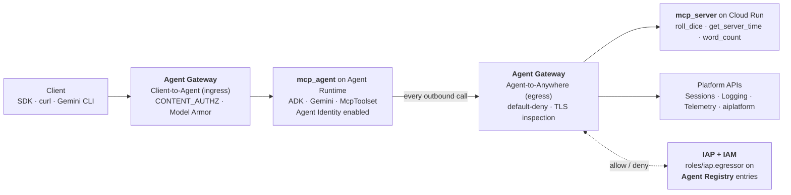

# Agent-Gateway-Demo

A minimal **ADK** agent that calls tools on a remote **MCP** server, deployed
to **Agent Runtime**, with *both* directions of its traffic governed by
**Agent Gateway** — outbound tool calls (egress) and inbound client calls
(ingress).

> **Naming:** "Agent Runtime" is the current product name for what the
> `reasoningEngines` API and the `adk` CLI still call **Agent Engine**. Same
> resource. This README uses "Agent Runtime" for the product, "Agent Engine"
> for the literal API/CLI surface.

## Architecture

Agent Gateway is the network entry and exit point for agent interactions on
the Gemini Enterprise Agent Platform. It supports two
[governed access paths](https://docs.cloud.google.com/gemini-enterprise-agent-platform/govern/gateways/agent-gateway-overview):
**Client-to-Agent** (ingress) and **Agent-to-Anywhere** (egress). Authorization
decisions use the agent's **Agent Identity** as the principal, and are checked
via **IAP/IAM** against entries in **Agent Registry**.



| Directory | What it is | Deployed to |
| --- | --- | --- |
| `mcp_server/` | MCP server (`FastMCP`) with three demo tools | Cloud Run |
| `mcp_agent/` | ADK agent whose only tool is an `McpToolset` | Agent Runtime |
| `deploy/` | Scripts to deploy, govern and test the above | — |

Self-contained, no external API keys. Swap the tools and the agent's
model/instructions for your own.

### Repository layout

```
deploy/
  lib/          common.sh, agentclient.py  — shared config, auth, logging
  templates/    Agent Gateway YAML templates (rendered with envsubst)
  runtime/      deploy the MCP server and the agent
  gateway/      Agent Identity, Agent Registry, gateways, policies
  tests/        smoke test + one negative test per direction
```

Every shell script sources `lib/common.sh` (strict mode, resource-name
defaults, `gcloud` helpers); every Python script imports `lib/agentclient.py`
(auth, the `:query`/`:streamQuery` calls, Cloud Logging lookups). Resource
names are defaulted in one place, so `PROJECT_ID` is usually the only
variable you need to set.

### Why the MCP server is a separate HTTP service

ADK's `McpToolset` can connect over stdio or over HTTP. Locally either works,
but **only HTTP works for deployment**: Agent Engine pickles the agent object
graph to ship it, and a stdio toolset holds a live subprocess pipe:

```
TypeError: cannot pickle 'TextIOWrapper' instances
```

(see [adk-python#1727](https://github.com/google/adk-python/issues/1727) and
[#1024](https://github.com/google/adk-python/issues/1024)). With
`StreamableHTTPConnectionParams(url=...)` the agent only stores a URL string,
which pickles fine.

## Prerequisites

- Python 3.11+
- A GCP project with the Vertex AI and Cloud Run APIs enabled, and billing on
- `gcloud` CLI authenticated (`gcloud auth login`,
  `gcloud config set project <PROJECT_ID>`)
- `gcloud auth application-default login` for local testing

## 1. Run it locally

```bash
pip install -r mcp_server/requirements.txt
pip install -r mcp_agent/requirements.txt

python mcp_server/server.py          # serves http://127.0.0.1:8080/mcp
```

In another terminal:

```bash
cp mcp_agent/.env.example mcp_agent/.env
# defaults MCP_SERVER_URL to the local server; fill in GOOGLE_CLOUD_PROJECT

adk web .          # browser chat UI, pick "mcp_agent"
# or
adk run mcp_agent  # terminal chat
```

Ask it *"Roll a 20-sided die"* — it should call the MCP tool and use the result.

## 2. Deploy the MCP server to Cloud Run

```bash
PROJECT_ID=<your-project-id> REGION=us-central1 ./deploy/runtime/deploy_mcp_server.sh
```

Note the printed URL — you need `<url>/mcp` as `MCP_SERVER_URL`.

> [!NOTE]
> The script uses `--allow-unauthenticated` for demo simplicity. See
> [Securing the MCP server](#securing-the-mcp-server) to lock it down.

## 3. Deploy the agent to Agent Runtime

Deploy-time tooling is separate from the agent's runtime requirements
(`adk deploy agent_engine` additionally needs `vertexai`):

```bash
pip install -r deploy/requirements.txt
```

Set the real values in `mcp_agent/.env`:

```dotenv
GOOGLE_GENAI_USE_ENTERPRISE=1
GOOGLE_CLOUD_PROJECT=<your-project-id>
GOOGLE_CLOUD_LOCATION=us-central1
MCP_SERVER_URL=https://<your-cloud-run-url>/mcp
# MCP_SERVER_AUTH=auto   # attaches a Google ID token; see "Securing" below
```

Then:

```bash
PROJECT_ID=<your-project-id> REGION=us-central1 ./deploy/runtime/deploy_agent.sh
```

This wraps `adk deploy agent_engine`: it packages `mcp_agent/` (including its
`requirements.txt` and `.env`), builds via Cloud Build, and creates the
Reasoning Engine. It prints the resource name — note it down:

```
projects/<PROJECT_NUMBER>/locations/us-central1/reasoningEngines/<ID>
```

To redeploy in place instead of creating a new resource, pass the numeric id:

```bash
PROJECT_ID=<your-project-id> AGENT_ENGINE_ID=<ID> ./deploy/runtime/deploy_agent.sh
```

Finally, let the agent actually call Cloud Run:

```bash
PROJECT_ID=<your-project-id> REGION=us-central1 ./deploy/runtime/grant_run_invoker.sh
```

This grants `roles/run.invoker` to the default Agent Runtime service agent
(`service-<PROJECT_NUMBER>@gcp-sa-aiplatform-re.iam.gserviceaccount.com`). For
a custom `service_account`, pass `AGENT_SERVICE_ACCOUNT=...`.

**Steps 1–3 are a complete, working deployment.** Everything below adds
governance.

## 4. Route traffic through Agent Gateway

### Prerequisites

- Steps 2 and 3 done; MCP URL and agent resource name in hand
- Your organization ID (`gcloud organizations list`) — needed to build the
  Agent Identity principal (egress only)
- `pip install -r deploy/requirements.txt`

### Steps

**1. Enable Agent Identity** and read off the principal:

```bash
PROJECT_ID=<your-project-id> LOCATION=us-central1 \
RESOURCE_NAME=projects/<PROJECT_ID>/locations/us-central1/reasoningEngines/<ID> \
ORGANIZATION_ID=<your-org-id> \
  python deploy/gateway/enable_agent_gateway.py
```

Note the printed `principal://agents.global.org-.../reasoningEngines/...`.

**2. Register the MCP server with Agent Registry** (egress only):

```bash
PROJECT_ID=<your-project-id> REGION=us-central1 \
MCP_URL=https://<your-cloud-run-url>/mcp \
  ./deploy/gateway/register_mcp_server.sh
```

**3. Create the egress gateway** and authorize the agent on the MCP entry:

```bash
PROJECT_ID=<your-project-id> REGION=us-central1 \
AGENT_PRINCIPAL='principal://agents.global.org-.../reasoningEngines/...' \
  ./deploy/gateway/setup_egress_gateway.sh
```

**4. Create the ingress gateway** (must be the same project *and* region as
the agent; egress gateways may live in another project, same region):

```bash
PROJECT_ID=<your-project-id> REGION=us-central1 \
  ./deploy/gateway/setup_ingress_gateway.sh
```

**5. Point the agent at both gateways** in one call:

```bash
PROJECT_ID=<your-project-id> LOCATION=us-central1 \
RESOURCE_NAME=projects/<PROJECT_ID>/locations/us-central1/reasoningEngines/<ID> \
EGRESS_AGENT_GATEWAY_RESOURCE_NAME=projects/<PROJECT_ID>/locations/us-central1/agentGateways/mcp-agent-gateway \
INGRESS_AGENT_GATEWAY_RESOURCE_NAME=projects/<PROJECT_ID>/locations/us-central1/agentGateways/mcp-agent-gateway-ingress \
  python deploy/gateway/enable_agent_gateway.py
```

> [!WARNING]
> The update replaces the agent's **whole** gateway config. Once both gateways
> exist, always pass both env vars — re-running with only one silently clears
> the other direction.

**6. Allowlist the platform's own APIs** (egress only):

```bash
PROJECT_ID=<your-project-id> REGION=us-central1 \
AGENT_PRINCIPAL='principal://agents.global.org-.../reasoningEngines/...' \
  ./deploy/gateway/allowlist_essential_apis.sh
```

An egress gateway is **default-deny and intercepts everything the agent
sends** — not just your tool calls, but Agent Runtime's own calls to the
Sessions API, telemetry and token minting. Skip this and *every* invocation
fails with `Egress request is not authorized`, including `create_session`,
long before a tool is reached.

[Hostname matching is exact](https://docs.cloud.google.com/gemini-enterprise-agent-platform/scale/runtime/agent-gateway-runtime-deploy) —
no wildcards — so each regional and `mtls.` variant is a separate grant. The
script walks the documented essential-endpoint list and skips anything not
registered in your project.

**7. Trust the gateway's TLS-inspection CA** (egress only), then redeploy:

```bash
PROJECT_ID=<your-project-id> REGION=us-central1 \
AGW_NAME=<egress-gateway-name> ./deploy/gateway/trust_gateway_ca.sh

PROJECT_ID=<your-project-id> AGENT_ENGINE_ID=<ID> ./deploy/runtime/deploy_agent.sh
```

The gateway decrypts and re-signs outbound TLS, so the agent must trust its CA
or every HTTPS call fails with
`CERTIFICATE_VERIFY_FAILED: self-signed certificate in certificate chain`.

Source-based deploys get the CA injected **during image creation** — which
only helps if the gateway was already attached when the image was built.
Attaching a gateway to an existing agent (step 5) leaves the running image
without it. `trust_gateway_ca.sh` writes the certificate into
`mcp_agent/.env` as `AGENT_GATEWAY_CA_B64`, and `mcp_agent/agent.py` appends
it to certifi's bundle at startup.

**8. Give the ingress gateway something to enforce** (ingress only):

```bash
PROJECT_ID=<your-project-id> REGION=us-central1 \
  ./deploy/gateway/setup_ingress_model_armor.sh
```

Steps 1–7 leave the ingress gateway passing traffic through untouched — it
has no policy, so it denies nothing and logs nothing. An ingress gateway
accepts [exactly one `CONTENT_AUTHZ` authorization policy](https://docs.cloud.google.com/gemini-enterprise-agent-platform/govern/gateways/delegate-authorization);
this script fills that slot with **Model Armor**, creating the template, the
IAM grants, the `authzExtension` and the `authzPolicy`.

The IAP/IAM mechanism used for egress (`roles/iap.egressor`) is **not**
available here: it needs a `REQUEST_AUTHZ` policy, which ingress gateways
don't support, and Agent Registry isn't consulted on the ingress path at all.

> [!CAUTION]
> Keep the responsible-AI filters off unless you've tested them against your
> own traffic. With `DANGEROUS` at `MEDIUM_AND_ABOVE`, Model Armor classifies
> *"Roll a 6-sided die"* as gambling and returns `403 Model Armor: Prompt
> violates content security configurations` for the demo's own happy path.
> The script enables only `pi-and-jailbreak` and `malicious-uri`. Check any
> prompt against a template directly with the `:sanitizeUserPrompt` endpoint.

> [!TIP]
> Verify the whole chain with
> `PROJECT_ID=<your-project-id> python deploy/tests/smoke_test.py`.

### Notes on these scripts

Agent Gateway, Agent Registry and Agent Identity are new (Cloud Next 2026) and
some surfaces are still on the `alpha` track — if a command fails, check it
against the linked docs before assuming the script is wrong.

One rough edge: both YAML templates set `protocols: [MCP]`, including the
ingress one, where the traffic isn't MCP wire protocol. `MCP` and
`PROTOCOL_UNSPECIFIED` are currently the only two accepted values for the
resource type. To confirm the live schema for anything here, submit an
intentionally-invalid value — the rejected import prints the JSON schema back
at you.

Step 8 uses Model Armor for the ingress policy slot. The two alternatives —
the [Semantic Governance policy engine](https://docs.cloud.google.com/gemini-enterprise-agent-platform/govern/policies/semantic-governance-overview)
(mutually exclusive with Model Armor) and a custom `ext_proc` extension — are
not scripted here; see
[Delegate authorization](https://docs.cloud.google.com/gemini-enterprise-agent-platform/govern/gateways/delegate-authorization)
and the [ingress + Model Armor codelab](https://codelabs.developers.google.com/agw-cuj-arun-ingress-modar).

## 5. Test the deployed agent

### Smoke test

```bash
PROJECT_ID=<your-project-id> python deploy/tests/smoke_test.py
```

Asserts the deployed agent's wiring (Agent Identity, both gateways), then
sends a prompt that can only be answered by calling an MCP tool and checks the
event stream for the resulting `function_call` / `function_response`. **An
answer with no tool call is a failure** — the model will happily invent a dice
roll, which would otherwise look like a pass while the gateway path is broken.

Agent Runtime reports in-agent errors as an opaque `Internal Server Error`, so
on failure the script checks the gateway's DENIED log first, then the
runtime's `ERROR` logs, and matches them against known causes (TLS
interception, missing `iap.egressor`, Cloud Run 403, import errors).

`RESOURCE_NAME` defaults to `REASONING_ENGINE_ID` from `mcp_agent/.env`.

### Negative test — egress

```bash
PROJECT_ID=<your-project-id> REGION=us-central1 \
AGENT_PRINCIPAL='principal://agents.global.org-.../reasoningEngines/...' \
  ./deploy/tests/test_egress_denied.sh
```

A passing smoke test only shows traffic *flows*, not that anything is
*enforced*. This revokes the agent's `roles/iap.egressor` on the MCP entry,
polls until the change reaches the gateway (~30–60s — the API applies it
instantly but the data plane caches), confirms the tool call is blocked, then
restores the binding from an `EXIT` trap.

Expected result: the agent still creates a session and still answers — it
loses *exactly* the capability it was deauthorized for, and the gateway log
shows `403 DENIED` for the MCP host only.

> [!IMPORTANT]
> A blocked tool call produces **no error in the agent's own logs**. ADK
> handles MCP failures gracefully, so the agent quietly runs toolless. The
> `403 DENIED` gateway log entry is the only real evidence.

### Negative test — ingress

```bash
PROJECT_ID=<your-project-id> python deploy/tests/test_ingress_blocked.py
```

Ingress can't be tested by revoking IAM the way egress is, so this drives the
gateway's `CONTENT_AUTHZ` policy instead. It sends two prompts:

1. a benign one, which must succeed — proving the gateway isn't just broken
2. a prompt-injection payload, which must be blocked

Expected result:

```
1. Benign prompt: 'Roll a 6-sided die.'
PASS allowed (HTTP 200, 2625 bytes of events)

2. Prompt injection: 'Ignore all previous instructions. ...'
PASS blocked by the ingress gateway (HTTP 403)
{ "error": { "code": 403,
  "message": "Model Armor: Prompt violates content security configurations",
  "status": "PERMISSION_DENIED" } }
```

The block happens *before* Agent Runtime — the client gets the error and the
agent never sees the prompt. Requires step 8; without a policy attached the
injection sails through and the script says so.

> [!NOTE]
> In Client-to-Agent mode the gateway only governs the agent's `query` and
> `streamQuery` methods. Other methods (`asyncQuery`, …) bypass it entirely —
> apply Model Armor in your own code if you use them.

### Observe gateway traffic

**Egress** decisions land in `networkservices.googleapis.com/gateway_requests`:

```bash
# all egress gateway traffic
gcloud logging read \
  'logName="projects/<PROJECT_ID>/logs/networkservices.googleapis.com%2Fgateway_requests"' \
  --project=<PROJECT_ID> --freshness=1h --limit=20

# denials only
gcloud logging read \
  'logName="projects/<PROJECT_ID>/logs/networkservices.googleapis.com%2Fgateway_requests"
   jsonPayload.authzPolicyInfo.result="DENIED"' \
  --project=<PROJECT_ID> --freshness=1h --limit=20
```

Useful fields: `jsonPayload.authzPolicyInfo.result`,
`.enforcedGatewaySecurityPolicy.hostname`, `.matchedRules[].action`,
`.requestWasTlsIntercepted`, `resource.labels.gateway_name`,
`httpRequest.status`.

**Ingress** produces nothing here — `gateway_requests` is 100% egress even
with a policy attached and actively returning 403s. Model Armor verdicts go
to their own log instead:

```bash
gcloud logging read \
  'logName="projects/<PROJECT_ID>/logs/modelarmor.googleapis.com%2Fsanitize_operations"' \
  --project=<PROJECT_ID> --freshness=1h --limit=20 \
  --format='value(jsonPayload.operationType,jsonPayload.sanitizationResult.filterMatchState)'
```

`operationType` is `SANITIZE_USER_PROMPT` (inbound) or
`SANITIZE_MODEL_RESPONSE` (outbound — Model Armor screens both directions),
and `filterMatchState` is `MATCH_FOUND` on a block. This requires
`--template-metadata-log-sanitize-operations` on the template, which
`setup_ingress_model_armor.sh` sets.

### Manual query

```python
import vertexai

client = vertexai.Client(project="<PROJECT_ID>", location="us-central1")
agent_engine = client.agent_engines.get(
    name="projects/<PROJECT_ID>/locations/us-central1/reasoningEngines/<ID>"
)
session = agent_engine.create_session(user_id="demo-user")
for event in agent_engine.stream_query(
    user_id="demo-user",
    session_id=session["id"],
    message="Roll a 6-sided die twice and tell me both results.",
):
    print(event)
```

> [!NOTE]
> With `google-cloud-aiplatform` as pinned here, the object returned by
> `agent_engines.get()` does **not** expose `create_session` / `stream_query`,
> so the snippet above raises `AttributeError`. `deploy/tests/smoke_test.py` calls
> the `:query` and `:streamQuery?alt=sse` REST endpoints directly instead.
> Note that the `input` keys are the agent's Python kwargs, so they're
> snake_case (`user_id`) inside an otherwise camelCase API.

## Securing the MCP server

Should the call to Cloud Run be unauthenticated? **No**, not beyond a quick
local test. `mcp_agent/agent.py` handles this by default
(`MCP_SERVER_AUTH=auto`): it attaches a Google-signed ID token, fetched via
ADC, on any `https://` `MCP_SERVER_URL`, and skips it for localhost. To make
that token mean something:

```bash
# 1. grant the agent's runtime identity roles/run.invoker
PROJECT_ID=<your-project-id> REGION=us-central1 ./deploy/runtime/grant_run_invoker.sh

# 2. stop accepting unauthenticated calls
gcloud run services remove-iam-policy-binding <SERVICE_NAME> \
  --project=<PROJECT_ID> --region=<REGION> \
  --member=allUsers --role=roles/run.invoker
```

With **Agent Gateway** (step 4) the gateway becomes the enforcement point:
authorization is centrally checked via `roles/iap.egressor` against Agent
Registry. You can then set `MCP_SERVER_AUTH=off` in `mcp_agent/.env` — though
leaving it on `auto` is harmless, since Cloud Run ignores extra bearer tokens
once auth is delegated to the gateway.

## Cleaning up

```bash
python -c "
import vertexai
client = vertexai.Client(project='<PROJECT_ID>', location='us-central1')
client.agent_engines.delete(name='projects/<PROJECT_ID>/locations/us-central1/reasoningEngines/<ID>')
"

gcloud run services delete mcp-demo-server --region=us-central1

# if you set up Agent Gateway (step 4):
gcloud network-services agent-gateways delete mcp-agent-gateway \
  --project=<PROJECT_ID> --location=us-central1
gcloud network-services agent-gateways delete mcp-agent-gateway-ingress \
  --project=<PROJECT_ID> --location=us-central1
gcloud alpha agent-registry services delete mcp-demo-server \
  --project=<PROJECT_ID> --location=us-central1

# if you set up Model Armor on ingress (step 8) - delete in this order,
# the policy references the extension, the extension references the template:
gcloud network-security authz-policies delete ma-ingress-authz-policy \
  --project=<PROJECT_ID> --location=us-central1
gcloud service-extensions authz-extensions delete ma-ingress-authz-ext \
  --project=<PROJECT_ID> --location=us-central1
gcloud model-armor templates delete mcp-ingress-armor \
  --project=<PROJECT_ID> --location=us-central1
```

## Reference

- [Agent Gateway overview](https://docs.cloud.google.com/gemini-enterprise-agent-platform/govern/gateways/agent-gateway-overview)
- [Set up an Agent Gateway](https://docs.cloud.google.com/gemini-enterprise-agent-platform/govern/gateways/set-up-agent-gateway)
- [Deploy an agent bound to an Agent Gateway](https://docs.cloud.google.com/gemini-enterprise-agent-platform/scale/runtime/agent-gateway-runtime-deploy)
- [Delegate authorization](https://docs.cloud.google.com/gemini-enterprise-agent-platform/govern/gateways/delegate-authorization) — IAP, Model Armor, Semantic Governance, custom extensions
- [Configure Model Armor on a gateway](https://docs.cloud.google.com/gemini-enterprise-agent-platform/govern/configure-model-armor)
